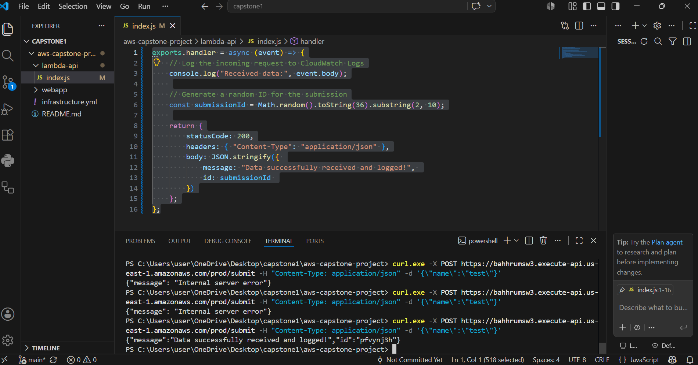
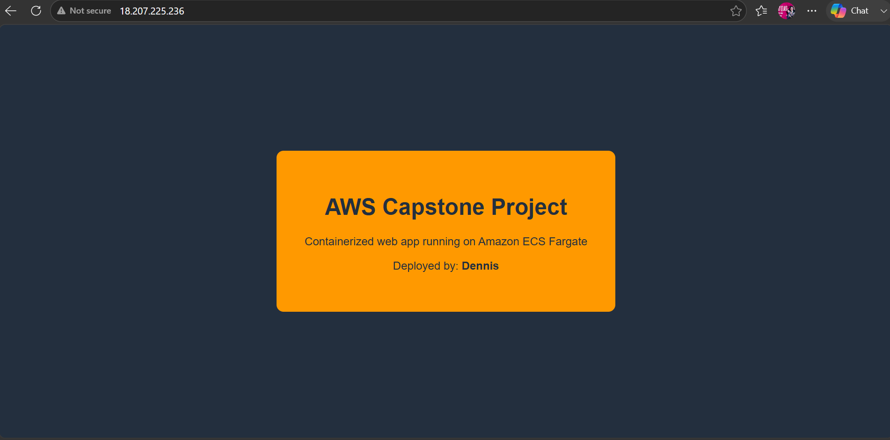
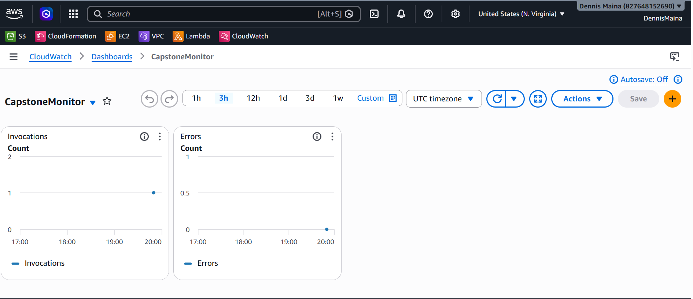

# AWS Capstone Project

A hybrid cloud-native application built on AWS, combining Serverless, Containers, Infrastructure as Code, and Observability.

## Architecture

- **Serverless API:** Amazon API Gateway + AWS Lambda handle backend POST requests
- **Containerized App:** Amazon ECS Fargate runs a lightweight Nginx web application
- **Infrastructure as Code:** AWS CloudFormation automates the ECS deployment
- **Observability:** Amazon CloudWatch collects logs and displays a monitoring dashboard

## Project Structure
## Step 1: Serverless API

- Created a Lambda function that accepts a JSON payload, logs it to CloudWatch, and returns a success message with a random ID.
- Connected it to API Gateway with a POST /submit route deployed to a prod stage.

### API Gateway Test Screenshot


## Step 2: Containerized Web App

- Built a simple Nginx web application and containerized it using Docker.
- Pushed the image to Amazon ECR.
- Deployed to ECS Fargate using a CloudFormation stack.

### Live ECS App Screenshot


## Step 3: Observability

- Generated traffic by sending multiple POST requests to the API Gateway endpoint.
- Created a CloudWatch Dashboard displaying Lambda Invocations and Errors metrics.

### CloudWatch Dashboard Screenshot


## Deployment

### Deploy the CloudFormation Stack
```bash
aws cloudformation create-stack --stack-name capstone-stack \
  --template-body file://infrastructure.yml \
  --capabilities CAPABILITY_NAMED_IAM
```

### Test the API
```bash
curl -X POST https://YOUR_API_URL/prod/submit \
  -H "Content-Type: application/json" \
  -d '{"name":"test"}'
```

## Live Endpoints

- **ECS Web App:** https://bahhrumsw3.execute-api.us-east-1.amazonaws.com/prod
- **API Gateway:** https://bahhrumsw3.execute-api.us-east-1.amazonaws.com/prod